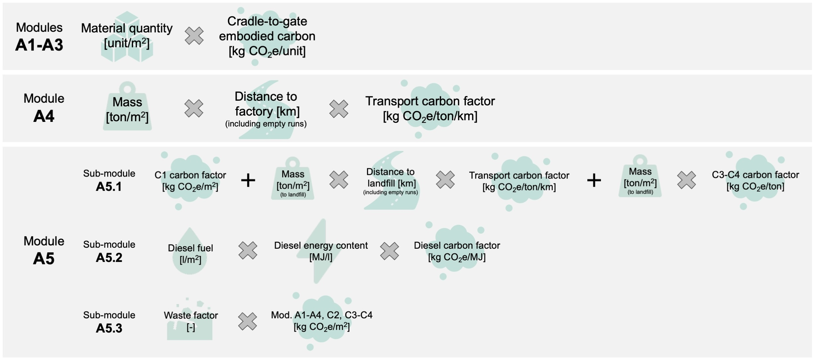

# 🌱 Global Embodied Carbon Model

# 📝 Methodology

Buildings generate both embodied and operational carbon throughout their life cycles. Embodied carbon includes emissions associated with life-cycle modules A1–A5, B1–B5, and C1–C4 (see figure below), while operational carbon pertains exclusively to modules B6–B7. Emissions from the material production stage can account for up to 50% of the total life-cycle carbon (embodied + operational) [^1], and approximately 85% of the total embodied carbon [^2]. The second-largest contributor is operational energy and water use (modules B6–B7).

Emissions resulting from earthquake-induced damage and subsequent repairs, referred to as average annual embodied carbon (AAEC), constitute an additional contribution to the embodied carbon released during the building’s use phase, specifically in modules B3–B5. Herein, we describe the workflow for calculating the AAEC for an individual building asset.

  Integration of average annual embodied carbon (AAEC) into a building life cycle. Attribution link: icons made by Good Ware from www.flaticon.com.

## Replacement Embodied Carbon

For calculating the replacement embodied carbon of a building asset, we combine the emissions associated with the construction of new buildings (modules A1–A5) and the end-of-life activities related to the demolition of existing buildings, which are considered under module A5, as detailed in the figure below.

  Workflow of the assessment of modules A1-A5 embodied carbon per square meter of built area. Attribution link: Icons made by Good Ware from www.flaticon.com.

For <b>modules A1-A3 (production)</b>, the embodied carbon of each individual component is calculated by multiplying the component quantity by its corresponding embodied carbon factor. 

The embodied carbon of <b>module A4 (transportation to construction site)</b>  is computed by multiplying the transported mass and distance (including empty return trips) by an appropriate transport emission factor (kg CO2e per ton-kilometer). We assume that heavy-duty vehicles (HDVs) transport materials an average of 120 km from factory to construction site, considering only national suppliers [^3]. An additional 70% is added to this distance to account for empty return trips. The transported mass is calculated by multiplying the quantities of structural and envelope components by their respective mass factors.

<b>Module A5 (construction)</b> includes emissions from pre-construction demolition (A5.1), construction activities (A5.2), and waste management (A5.3).

A5.1 (pre-construction demolition) includes the demolition or deconstruction of existing damaged buildings and is equivalent to the C1–C4 end-of-life impacts of the replaced asset. For module C1 (demolition), we assume conventional demolition practices with minimal material recovery [^3]. Module C2 (waste transport) is assessed similarly to A4, but using a shorter average distance of 50 km, as landfill sites are generally local [^5]. A 50% increase is applied to account for empty return trips. Modules C3 and C4 (waste processing and disposal) are calculated using average emission factors (kg CO2e per kg of waste), with region-specific assumptions on the share of materials sent to landfill.

For A5.2 (construction activities), we estimate on-site emissions from diesel-powered machinery (e.g., cranes) used to lift materials to mid-building height, applying empirical emission relationships [^4].

For A5.3 (waste management), we apply differentiated waste rates by material/component type [^3]. The emissions from this sub-module are calculated based on these rates and the associated embodied carbon of modules A1–A3, A4, C2, and C3–C4, accounting for the final treatment route (landfill or incineration) of the construction waste.

Based on the dominant structural systems and materials used in current construction practices in the region, each building asset is assigned a replacement building type, categorised according to the GEM Building Taxonomy v3.2. For each typology and occupancy, we identify the main structural and non-structural components, their respective materials, and average quantities (per square meter of built area). By multiplying these quantities by the corresponding carbon factors (described above), we estimate the replacement embodied carbon per square meter of each building asset of the exposure.

To create regional maps of the replacement embodied carbon, we reprocess GEM exposure models ([v2023.1](https://github.com/gem/global_exposure_model)) by assigning embodied carbon values as environmental equivalents to economic replacement costs. The result is a regional exposure dataset that characterises the replacement embodied carbon of the existing building stock across the region.

## Seismic Embodied Carbon

To expand traditional seismic risk metrics and integrate environmental considerations, we introduce the concept of average annual embodied carbon (AAEC). This indicator quantifies the expected yearly embodied carbon emissions resulting from earthquake-induced damage and subsequent repair or reconstruction activities. By translating physical damage into environmental impact, the AAEC complements conventional metrics such as economic losses and fatalities, helping to better inform sustainable risk reduction strategies.

We compute the AAEC for each building asset in the region by establishing a direct proportional relationship with the average annual loss ratios (AALRs) provided by the latest GEM Global Seismic Risk Model ([v2023.1](https://zenodo.org/records/8409623)). These AALRs represent the expected annual economic losses due to seismic events as a fraction of the total replacement value of the asset itself. By linking these loss ratios to the replacement embodied carbon, we convert financial risk metrics into environmental ones, yielding spatially distributed estimates of AAEC at the national/regional level.

For further details on the methodology, refer to the publications listed below.

## References

[^1]: LETI. Embodied Carbon Primer - Supplementary Guidance to the Climate Emergency Design Guide. (2020).
[^2]: Magwood, C. & Huynh, T. The Hidden Climate Impact of Residential Construction. (2023).
[^3]: RICS. Whole Life Carbon Assessment for the Built Environment RICS Professional Standard. www.rics.org (2023).
[^4]: Athena Sustainable Materials Institute. Maintenance, Repair, and Replacement Effects for Building Envelope Materials. (2002).
[^5]: Hart, J., D’Amico, B. & Pomponi, F. Whole-life embodied carbon in multistory buildings: Steel, concrete and timber structures. J Ind Ecol 25, 403–418 (2021).

# 📚 Publications

Martina Caruso, Vitor Silva, Karim Aljawhari, Al Mouayed Bellah Nafeh, Carmine Galasso. Unveiling the Environmental Impact of Earthquakes in Europe, 08 November 2024, PREPRINT (Version 1) available at Research Square [https://doi.org/10.21203/rs.3.rs-5283610/v1].

If you use the data or resources provided in this repository, please acknowledge the GEM Foundation as follows:
Global Earthquake Model (GEM) Foundation. Global Embodied Carbon Model. Available at: https://github.com/gem/global_embodied_carbon_model/tree/main.
